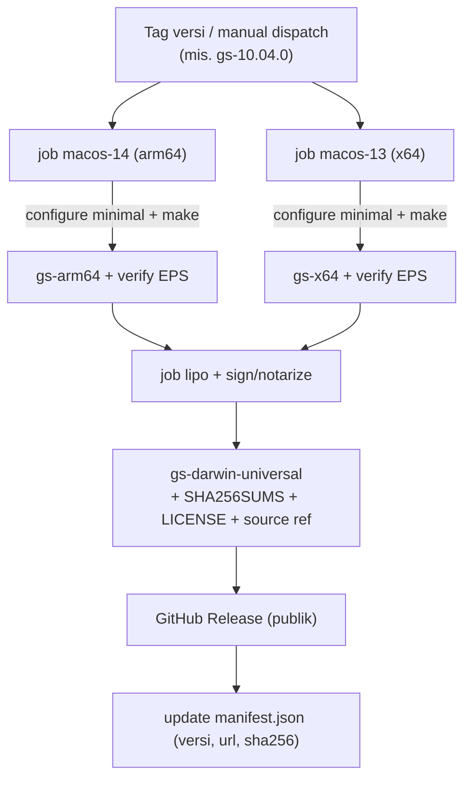
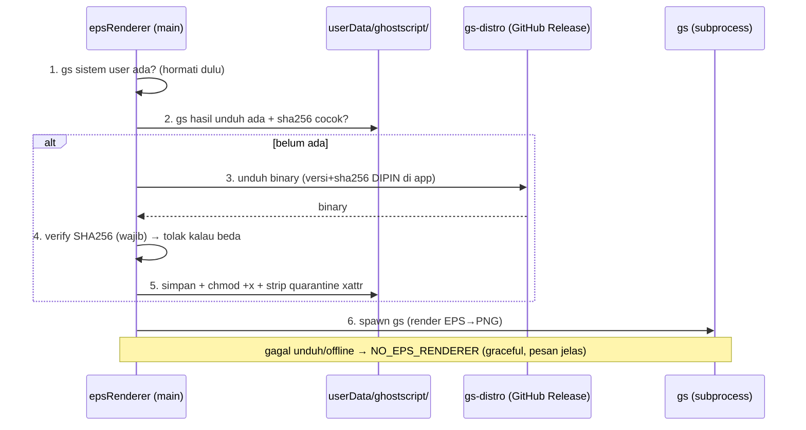

# PLAN — Repo Publik "Ghostscript Distro" untuk Rendering EPS Mi-Farm

> Dikerjakan di **sesi/repo terpisah**. Dokumen ini = spesifikasi lengkap: kenapa,
> apa yang di-build, kepatuhan lisensi, pipeline rilis, dan **kontrak integrasi**
> ke Mi-Farm. Boleh langsung dijadikan README repo baru.

## 1. Konteks & tujuan

Fitur **Metadata → EPS** butuh interpreter PostScript (Ghostscript) untuk
me-render EPS jadi raster (JPEG/PNG) sebelum dikirim ke AI. Mi-Farm sengaja
**tidak mem-bundle gs** (gs = **AGPL-3.0**; bundling di app komersial memicu
kewajiban lisensi). Solusi: **repo publik terpisah** berperan sebagai
**redistributor gs yang patuh AGPL**; Mi-Farm mengunduh binary dari repo ini
saat dibutuhkan.

**Kenapa terpisah (bukan di dalam Mi-Farm):** hanya repo distro ini yang memikul
kewajiban AGPL §6 (menyediakan source + notice). Mi-Farm memanggil `gs` sebagai
**subprocess (arm's-length)** → *mere aggregation* → **Mi-Farm tetap proprietary.**

## 2. Keputusan scope — hanya host yang benar-benar hilang: **macOS**

| Platform | Sumber gs | Perlu repo ini? |
|---|---|---|
| **macOS (arm64 + x64)** | **Artifex TIDAK merilis binary Mac** — user biasanya lewat Homebrew (compile) | ✅ **Ya — inti repo ini** |
| Windows | Artifex merilis `.exe` resmi di GitHub | ❌ Unduh dari Artifex langsung (bukan kita yang distribusi) |
| Linux | gs ada di repo distro / user | ❌ Deteksi gs sistem |

→ Meminimalkan yang **kita** redistribusi = minim maintenance + minim permukaan lisensi.
Repo ini fokus **macOS saja**.

## 3. ✅ Checklist kepatuhan AGPL (alasan utama repo ini ada)

Repo = distributor binary gs → wajib AGPL §6:
- [ ] **LICENSE**: sertakan teks **AGPL-3.0** + copyright Artifex/Ghostscript.
- [ ] **Corresponding Source**: pin **versi gs persis**, dan sediakan/point ke
      source tarball Artifex versi itu (mirror tarball di rilis, atau tautkan URL resmi + arsipkan).
- [ ] **Build scripts di repo** (bagian dari "corresponding source" — biar binary reproducible).
- [ ] **Notice** di README: versi gs, dari source mana, patch (jika ada), cara rebuild.
- [ ] **Sinkron per rilis**: setiap binary rilis di-tag dengan versi gs-nya + source-nya.
- [ ] (Disarankan) **sign-off legal sekali** — reading mainstream aman (subprocess = separate work), tapi ini keputusan distribusi.

> §13 AGPL (network) **tidak** kena: gs jalan lokal sebagai CLI, bukan layanan jaringan.

## 4. Apa yang di-build — gs minimal & **self-contained**

Target: **satu executable `gs` per-arch** yang jalan tanpa file resource eksternal.

- **`COMPILE_INITS=1`** (default di gs modern) → file init PostScript + resource
  di-*bake* ke dalam binary → **tak butuh folder `Resource/`** di runtime. Kunci portabilitas.
- **Device minimal**: cukup `jpeg` + `pngalpha` (EPS→JPEG/PNG). Sisanya bisa dipangkas.
- **Matikan yang tak perlu** saat `./configure`: `--without-x` (no X11),
  `--disable-cups`, `--disable-gtk`, `--without-tesseract` (no OCR) → kecil + aman.
- gs memakai **libjpeg/libpng/zlib/freetype bawaan source-nya** → dependency
  eksternal minim (portable lintas versi macOS).
- Ukuran akhir ± **15–30 MB**. Wajar untuk diunduh sekali & di-cache.

### Resep build macOS (titik awal — verifikasi URL/versi saat eksekusi)
```bash
GS_VERSION=10.04.0
# Source resmi Artifex (tag rilis mis. gs10040). Arsipkan tarball ini di repo (AGPL §6).
curl -L -o ghostpdl.tar.gz \
  "https://github.com/ArtifexSoftware/ghostpdl-downloads/releases/download/gs10040/ghostpdl-${GS_VERSION}.tar.gz"
tar xf ghostpdl.tar.gz && cd ghostpdl-${GS_VERSION}

./configure --without-x --disable-cups --disable-gtk --without-tesseract
make -j"$(sysctl -n hw.ncpu)"          # hasil: ./bin/gs (self-contained via COMPILE_INITS)

# Uji cepat: EPS → PNG
./bin/gs -dNOPAUSE -dBATCH -dSAFER -sDEVICE=pngalpha -dEPSCrop -r150 \
  -sOutputFile=/tmp/test.png examples/*.eps && echo "OK"
```
- **arm64 & x64**: build masing-masing di runner native (`macos-14`=arm64, `macos-13`=x64) — cross-compile gs itu rewel. Lalu gabung:
  ```bash
  lipo -create gs-arm64 gs-x64 -output gs-darwin-universal
  ```
  → satu binary universal jalan di semua Mac. (Alternatif: rilis 2 file per-arch, manifest pilih.)

## 5. Struktur repo

```
mi-farm-gs-distro/
├── README.md            # notice AGPL + versi + cara rebuild
├── LICENSE              # AGPL-3.0
├── build/
│   ├── build-macos.sh   # resep di atas, parametrik versi + arch
│   └── verify.sh        # render EPS uji, cek exit 0 + output non-kosong
├── source/              # (opsi) mirror tarball gs untuk arsip "corresponding source"
│   └── ghostpdl-10.04.0.tar.gz
├── manifest.json        # metadata rilis terkini (dibaca Mi-Farm) — lihat §7
└── .github/workflows/
    └── release.yml      # build arm64+x64 → lipo → sign/notarize → GitHub Release
```

## 6. Pipeline build & rilis (GitHub Actions)



Prinsip: **pin versi gs**, build reproducible dari source, **verify render** sebelum publish, lampirkan **checksum + source + license** di tiap rilis.

## 7. Artefak rilis + skema `manifest.json`

Tiap GitHub Release memuat: `gs-darwin-universal` (atau per-arch), `SHA256SUMS`, `LICENSE`, catatan source.

`manifest.json` (untuk penemuan oleh Mi-Farm):
```json
{
  "ghostscriptVersion": "10.04.0",
  "platforms": {
    "darwin-universal": {
      "url": "https://github.com/<org>/mi-farm-gs-distro/releases/download/gs-10.04.0/gs-darwin-universal",
      "sha256": "<hex>",
      "size": 20871234
    }
  }
}
```

## 8. Kontrak integrasi Mi-Farm (sisi konsumen — dikerjakan di repo Mi-Farm)



Aturan integrasi:
1. **Prioritas gs sistem user** (kalau ada) → hormati, tak perlu unduh.
2. **Pin versi + SHA256 di dalam Mi-Farm** (paling aman) — app hanya menerima binary
   dengan hash yang diketahui. Bump gs = rilis Mi-Farm baru (jarang, sesuai sifat fitur).
   (Alternatif fleksibel: baca `manifest.json`; kurang aman karena mutable.)
3. **Cache di `app.getPath('userData')/ghostscript/gs`** → unduh sekali saja.
4. Gagal/offline → `NO_EPS_RENDERER` (perilaku graceful yang sudah ada).
5. epsRenderer: buang jalur `qlmanage` (rusak di macOS modern); pakai gs ini.

## 9. Keamanan (penting — app mengeksekusi binary terunduh)

- **SHA256 wajib diverifikasi** sebelum eksekusi; hash **dipin di app**, bukan hanya di manifest.
- **HTTPS + repo/rilis yang di-pin**.
- **Gatekeeper/quarantine macOS**: file terunduh dapat atribut `com.apple.quarantine`
  → eksekusi bisa diblokir/prompt. Dua mitigasi:
  - **(Disarankan) codesign + notarize** binary gs di pipeline (butuh Apple Developer ID) → jalan mulus, tanpa strip.
  - **Minimal**: app **strip quarantine** setelah unduh (`xattr -d com.apple.quarantine <path>` atau via API), lalu `chmod +x`.
- Binary self-contained (§4) → tak menarik dylib sistem tak terduga.

## 10. Versi & maintenance (beban rendah — sesuai)

- **Pin satu versi gs**; bump **hanya** saat ada perbaikan keamanan gs. EPS→raster stabil.
- Rilis baru = jalankan workflow (bump versi → build → verify → release → update hash di Mi-Farm).
- Realistis: **beberapa kali setahun atau lebih jarang**. Cocok dengan "hampir tidak pernah berubah".

## 11. Checklist eksekusi (untuk sesi berikutnya)

**Repo distro:**
1. [ ] Buat repo publik `mi-farm-gs-distro` + LICENSE (AGPL-3.0) + README notice.
2. [ ] `build/build-macos.sh` (parametrik `GS_VERSION`, arch) + `build/verify.sh`.
3. [ ] Build lokal arm64 & x64, `lipo`, uji render EPS contoh.
4. [ ] `.github/workflows/release.yml`: matrix macos-14/macos-13 → lipo → (sign/notarize) → Release + SHA256SUMS + LICENSE.
5. [ ] (Legal) arsipkan source tarball gs + tautkan; sign-off sekali.
6. [ ] Rilis pertama `gs-<versi>`, catat SHA256.

**Sisi Mi-Farm (repo ini, sesi lain):**
7. [ ] `epsRenderer.detect()`: (a) gs sistem user → (b) gs cache userData → (c) unduh dari distro (versi+sha256 dipin) → verify → chmod → strip quarantine. Buang `qlmanage`.
8. [ ] Pesan UI saat EPS butuh gs & unduh berjalan/gagal (progress + fallback).
9. [ ] Unit test: resolusi path + verifikasi sha256 (mock fs/unduh).

## 12. Risiko / pertanyaan terbuka

- **Notarization**: butuh Apple Developer ID cert. Kalau tak ada → andalkan strip-quarantine (jalan, sedikit kurang mulus). Mi-Farm dist:mac saat ini *ad-hoc sign* (bukan Developer ID) → kemungkinan pakai strip-quarantine dulu.
- **Universal vs per-arch**: universal (lipo) paling simpel untuk user; ukuran ~2×. Rekomendasi: universal.
- **Cross-compile**: hindari — build per-arch di runner native lalu lipo.
- **Legal**: reading subprocess/mere-aggregation aman & mainstream, tapi konfirmasi sekali dengan penasihat hukum sebelum go-public.
- **Bump versi gs**: karena SHA256 dipin di Mi-Farm, butuh rilis Mi-Farm untuk update — dapat diterima mengingat frekuensi rendah.
```
